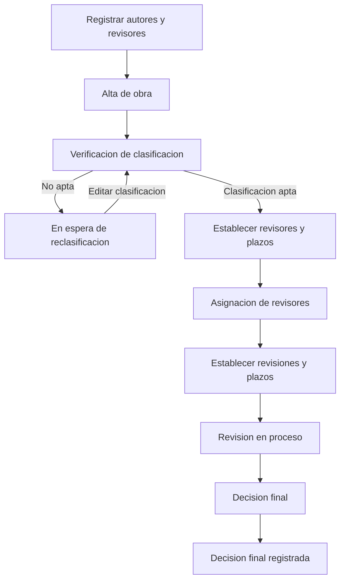

# Guía funcional

Documento orientado a cualquier persona que necesite entender el propósito de la aplicación, quién puede hacer qué y cómo se gestiona una obra desde el alta hasta la decisión final.

Para detalles técnicos de componentes o integración con backend, consulta [REFERENCIA-COMPONENTES.md](REFERENCIA-COMPONENTES.md) e [INTEGRACION-BACKEND.md](INTEGRACION-BACKEND.md).

---

## Propósito de la aplicación

El **Gestor de obras del Consejo Editorial** es una aplicación web para la UAM que centraliza:

- El registro de **obras** sometidas al Consejo Editorial.
- Los catálogos de **autores**, **revisores** y **miembros del CE**.
- El **seguimiento del proceso editorial** de cada obra por etapas secuenciales.

---

## Roles y permisos

### Administrador

Puede realizar todas las operaciones de escritura:

- Crear, editar y eliminar obras, autores, revisores y miembros del CE.
- Acceder al **detalle de una obra** y avanzar por las etapas del flujo editorial.
- Gestionar plazos, asignación de revisores, revisiones y decisión final.

### Miembro del Consejo Editorial

Acceso de **solo lectura**:

- Consultar listados de obras, autores y revisores.
- No ve botones de alta, edición ni eliminación.
- No puede acceder al detalle de una obra ni al módulo de Miembros CE.

### Pantallas y acceso

| Ruta | Pantalla | Descripción | Administrador | Miembro CE |
|------|----------|-------------|:-------------:|:----------:|
| `/login` | Inicio de sesión | Acceso con usuario y contraseña | Sí | Sí |
| `/` | Obras | Listado de obras con barra de avance | Lectura y escritura | Solo lectura |
| `/autores` | Autores | Catálogo de autores de obras | Lectura y escritura | Solo lectura |
| `/revisores` | Revisores | Catálogo de revisores disponibles | Lectura y escritura | Solo lectura |
| `/miembros-ce` | Miembros CE | Personas del Consejo Editorial | Lectura y escritura | Sin acceso |
| `/obras/:obraId` | Detalle de obra | Flujo editorial completo de una obra | Lectura y escritura | Sin acceso |

---

## Flujo de uso desde una obra nueva

### Prerrequisitos

Antes de registrar una obra, el administrador debe contar con:

1. **Autores** registrados en `/autores` (nombre, apellidos y correo).
2. **Revisores** registrados en `/revisores` (misma estructura).
3. **Miembros del CE** registrados en `/miembros-ce` (necesarios para futuras notificaciones por correo).

### Paso 1 — Alta de la obra

Desde la pantalla **Obras** (`/`), el administrador pulsa **Nueva obra** y completa:

- **Título** de la obra.
- **Clasificación** (Libro de texto, Libro científico, Notas de curso, Paquetes de cómputo, Libro de divulgación, etc.).
- **Autores** asociados (seleccionados del catálogo).

Al guardar, la obra queda en estado **Verificación de la clasificación** y aparece en el listado con un porcentaje de avance inicial.

### Paso 2 — Abrir el detalle de la obra

Solo el administrador puede entrar al detalle haciendo clic en el título de la obra. Ahí se muestra:

- Una **tarjeta resumen** (título, clasificación, autores, estado actual, gráfica de avance).
- Las **seis etapas del flujo editorial**, desbloqueadas de forma secuencial.

### Paso 3 — Etapas del flujo editorial

Las etapas deben completarse **en orden**. Cada una tiene un botón **Editar** que solo está disponible cuando las etapas anteriores ya fueron completadas.

| # | Etapa | Qué hace el administrador | Resultado |
|---|-------|---------------------------|-----------|
| 1 | Verificación de la clasificación | Indica si la clasificación propuesta es apta | Si es apta → continúa el flujo. Si no → la obra queda **en espera de reclasificación del autor** hasta que se modifique la clasificación |
| 2 | Establecer revisores y plazos | Define cuántos revisores se necesitan como mínimo y la fecha límite para asignarlos | La obra pasa a etapa de asignación |
| 3 | Asignación de revisores | Añade o quita revisores del catálogo; ve temporizador y progreso | Al cumplir el mínimo (o avanzar manualmente con al menos un revisor) → siguiente etapa |
| 4 | Establecer revisiones y plazos | Define cuántas revisiones mínimas se requieren y la fecha límite (posterior a la de asignación) | La obra entra en revisión en proceso |
| 5 | Revisión en proceso | Marca cada revisor asignado como revisión completada o pendiente | Al cumplir el mínimo (o avanzar manualmente) → decisión final |
| 6 | Toma de decisión final | Elige: **Aprobar obra**, **Rechazar obra** o **Solicitar modificaciones** | La obra queda en **Decisión final registrada** (100 % de avance) |

### Regla de cascada

Si el administrador **revierte** una etapa (por ejemplo, quita un revisor o desmarca una revisión), **todas las etapas posteriores se invalidan** y deben completarse de nuevo. Lo mismo ocurre si se **cambia la clasificación** de la obra: el flujo reinicia desde la verificación.

### Diagrama del flujo

---

## Notificaciones por correo — Futura implementación

> **Importante:** en la versión actual **no se envía ningún correo electrónico**. Algunos diálogos de confirmación mencionan que se notificará al consejo, pero eso es una funcionalidad **pendiente de implementar** en el backend.

La tabla siguiente describe las acciones que deberían disparar un correo cuando se implemente el servicio de notificaciones. La columna **Mensaje** queda pendiente de redactar.

| Acción | Página | Destinatarios | Mensaje |
|--------|--------|---------------|---------|
| Al guardar una nueva obra | Obras | Miembros CE | Por definir |
| Al modificar la clasificación | Obras | Miembros CE | Por definir |
| Al modificar la clasificación | Detalle de obra | Miembros CE | Por definir |
| Al guardar «Sí» en la verificación de clasificación | Detalle de obra | Autores y miembros CE | Por definir |
| Al guardar «No» en la verificación de clasificación | Detalle de obra | Autores y miembros CE | Por definir |
| Al guardar número de revisores y fecha límite | Detalle de obra | Autores y miembros CE | Por definir |
| Al asignar un revisor | Detalle de obra | Autores, miembros CE y revisores | Por definir |
| Cuando se acaba el tiempo para asignar revisores | Detalle de obra | Autores y miembros CE | Por definir |
| Cuando se alcanzaron todos los revisores | Detalle de obra | Autores y miembros CE | Por definir |
| Cuando se decidió continuar con los revisores | Detalle de obra | Autores y miembros CE | Por definir |
| Al guardar número de revisiones y fecha límite | Detalle de obra | Autores, miembros CE y revisores | Por definir |
| Al marcar una revisión | Detalle de obra | Autores, miembros CE y revisores | Por definir |
| Cuando se acaba el tiempo para revisar | Detalle de obra | Autores, miembros CE y revisores | Por definir |
| Cuando se alcanzaron las revisiones | Detalle de obra | Autores y miembros CE | Por definir |
| Cuando se decidió continuar | Detalle de obra | Autores y miembros CE | Por definir |
| Al guardar la decisión final | Detalle de obra | Autores y miembros CE | Por definir |

**Notas:**

- Los destinatarios **Miembros CE** se obtienen del catálogo `/miembros-ce` (campo `correo`); los **autores** y **revisores**, de los catálogos correspondientes vinculados a la obra.
- 

---

## Estado del proyecto

| Área | Estado | Notas |
|------|--------|-------|
| Interfaz de usuario (React) | Implementado | Pantallas, formularios, flujo por etapas |
| Catálogos (autores, revisores, miembros CE) | Implementado | CRUD completo para administrador |
| Flujo editorial de obras | Implementado | 6 etapas con validaciones en frontend |
| Autenticación por roles | Implementado (provisional) | Usuarios simulados + Firebase Auth |
| Persistencia de datos | Implementado (provisional) | Cloud Firestore |
| Envío de correos / notificaciones | **Pendiente** | Solo mencionado en diálogos de confirmación |
| Backend propio (API REST) | **Pendiente** | Mauricio — ver [INTEGRACION-BACKEND.md](INTEGRACION-BACKEND.md) |
| Autenticación con JWT real | **Pendiente** | Reemplazará auth simulada actual |

---

## Documentación relacionada

- [README.md](../README.md) — Instalación y configuración del proyecto.
- [REFERENCIA-COMPONENTES.md](REFERENCIA-COMPONENTES.md) — Qué hace cada componente de la interfaz.
- [INTEGRACION-BACKEND.md](INTEGRACION-BACKEND.md) — Guía técnica para Mauricio.
