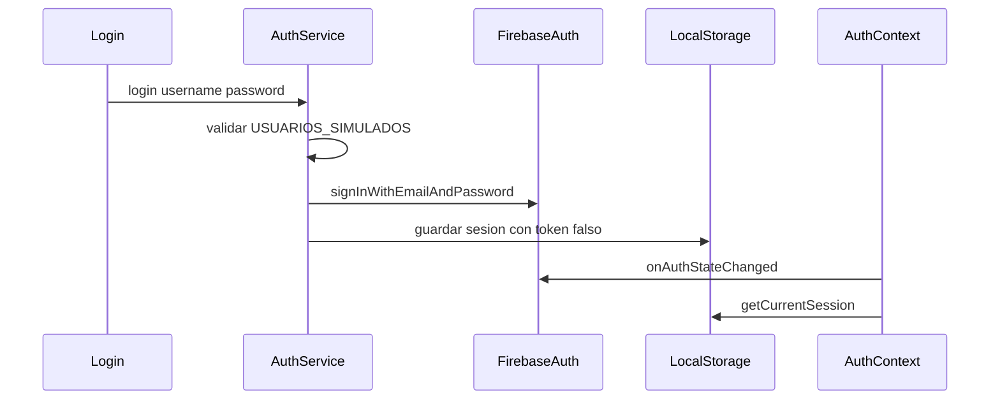
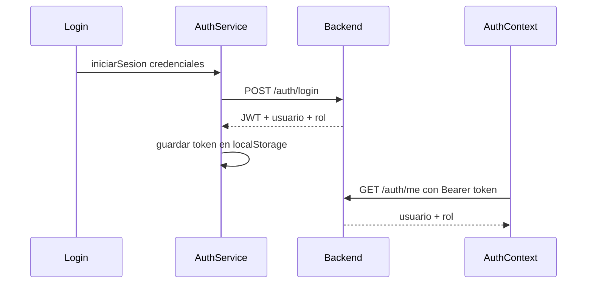

# Integración con backend

Guía técnica para conectar el frontend con un backend propio (API REST), reemplazando Firebase como capa de datos y autenticación.

Para el flujo de negocio, ver [GUIA-FUNCIONAL.md](GUIA-FUNCIONAL.md). Para el catálogo de componentes, ver [REFERENCIA-COMPONENTES.md](REFERENCIA-COMPONENTES.md).

---

## Principio de integración

```
UI (pages/components)
       ↓
src/services/*.js   ← capa a reemplazar
       ↓
Backend REST
```

Los componentes en `src/pages/` **no acceden a Firebase directamente**. Toda comunicación con datos pasa por `src/services/`. Al migrar al backend:

1. Reescribir el **interior** de cada archivo en `src/services/`.
2. Mantener las **mismas funciones exportadas** y la **misma forma de los objetos** devueltos.
3. Los componentes en `pages/` **no deberían requerir cambios**.

Excepción actual: `src/context/Auth.jsx` escucha `onAuthStateChanged` de Firebase. También habrá que adaptarlo.

---

## Modelos de datos (contratos)

### Obra

**Campos del formulario de alta** (enviados por el frontend):

| Campo | Tipo | Descripción |
|-------|------|-------------|
| `titulo` | `string` | Título de la obra |
| `clasificacion` | `string` | Una de las opciones del select (ver abajo) |
| `autores` | `string[]` | IDs de documentos en la colección `autores` |

**Valores permitidos de `clasificacion`:**

- Libro de texto
- Libro científico
- Notas de curso normal
- Notas de curso especial
- Paquete de computo de docencia
- Paquete de cómputo científico
- Libro de divulgación

**Campos que el backend debe inicializar al crear una obra:**

| Campo | Tipo | Valor inicial |
|-------|------|---------------|
| `id` | `string` | Generado por el backend |
| `fechaAlta` | timestamp / ISO string | Fecha de creación |
| `estado` | `string` | `'Verificación de la clasificación'` |
| `clasificacionApta` | `boolean \| null` | `null` |
| `revisoresMinimos` | `number \| null` | `null` |
| `fechaLimiteRevisores` | timestamp / ISO string \| null | `null` |
| `revisoresAsignados` | `array` | `[]` |
| `etapasCompletadas` | `boolean[6]` | `[false, false, false, false, false, false]` |
| `revisionesMinimas` | `number \| null` | `null` |
| `fechaLimiteRevisiones` | timestamp / ISO string \| null | `null` |
| `decisionFinal` | `string \| null` | `null` |

**Estructura de `revisoresAsignados`:**

```json
[
  { "id": "id-del-revisor", "revisionCompletada": false }
]
```

**Valores posibles de `estado`:**

| Estado | Cuándo se asigna |
|--------|-----------------|
| `Verificación de la clasificación` | Alta de obra o cambio de clasificación |
| `En espera a reclasificación del autor` | Clasificación marcada como no apta |
| `Establecer revisores y plazos` | Tras verificación apta |
| `Asignación de revisores` | Tras definir plazos de revisores |
| `Establecer revisiones y plazos` | Tras cumplir mínimo de revisores asignados |
| `Revisión en proceso` | Tras definir plazos de revisiones |
| `Toma de decisión final` | Tras cumplir mínimo de revisiones |
| `Decisión final registrada` | Tras registrar decisión final |

**Valores posibles de `decisionFinal`:**

- `Aprobar obra`
- `Rechazar obra`
- `Solicitar modificaciones`

**Regla de `etapasCompletadas`:** array de 6 booleanos. Si una etapa se marca como incompleta, todas las posteriores deben ponerse en `false` (regla de cascada en `src/utils/obraUtils.js`).

**Formato de fechas:** el componente `Temporizador` espera objetos con método `.toDate()` (Firestore Timestamp) o equivalente. Si el backend devuelve ISO strings, habrá que adaptar `Temporizador.jsx` y los componentes de plazos.

---

### Autor, Revisor, Miembro CE

Estructura idéntica para las tres entidades:

| Campo | Tipo | Descripción |
|-------|------|-------------|
| `id` | `string` | Generado por el backend |
| `nombre` | `string` | Nombre(s) |
| `apellidoPaterno` | `string` | Apellido paterno |
| `apellidoMaterno` | `string` | Apellido materno |
| `correo` | `string` | Correo electrónico (validado en frontend) |
| `fechaAlta` | timestamp / ISO string | Fecha de registro |

**Colecciones/recursos actuales en Firestore:**

| Entidad | Colección Firestore | Servicio |
|---------|---------------------|----------|
| Obra | `obras` | `obrasService.js` |
| Autor | `autores` | `autoresService.js` |
| Revisor | `revisores` | `revisoresService.js` |
| Miembro CE | `miembrosCE` | `miembrosCEService.js` |

---

## Mapa servicio → endpoints sugeridos

### authService.js

| Función actual | Endpoint sugerido | Método |
|----------------|-------------------|--------|
| `login({ username, password })` | `/auth/login` | POST |
| `logout()` | `/auth/logout` | POST |
| `getCurrentSession()` | `/auth/me` | GET |

**Respuesta esperada de `POST /auth/login`:**

```json
{
  "usuario": {
    "id": "string",
    "username": "string",
    "nombre": "string",
    "rol": "admin | miembro"
  },
  "accessToken": "jwt...",
  "refreshToken": "jwt..."
}
```

**Roles:** `admin` (escritura completa) y `miembro` (solo lectura). Definidos en `ROLES` de `authService.js`.

---

### obrasService.js

| Función actual | Endpoint sugerido | Método |
|----------------|-------------------|--------|
| `registrarObra(obra)` | `/obras` | POST |
| `obtenerObras()` | `/obras` | GET |
| `obtenerObra(id)` | `/obras/:id` | GET |
| `actualizarObra(id, datos)` | `/obras/:id` | PATCH o PUT |
| `eliminarObra(id)` | `/obras/:id` | DELETE |

> Hoy el frontend envía el **documento completo** en cada actualización de etapa. El backend puede aceptar PATCH parcial o exponer endpoints por transición (ej. `POST /obras/:id/verificar-clasificacion`).

---

### autoresService.js

| Función actual | Endpoint sugerido | Método |
|----------------|-------------------|--------|
| `registrarAutor(autor)` | `/autores` | POST |
| `obtenerAutores()` | `/autores` | GET |
| `obtenerAutor(id)` | `/autores/:id` | GET |
| `actualizarAutor(id, datos)` | `/autores/:id` | PATCH o PUT |
| `eliminarAutor(id)` | `/autores/:id` | DELETE |

---

### revisoresService.js

| Función actual | Endpoint sugerido | Método |
|----------------|-------------------|--------|
| `registrarRevisor(revisor)` | `/revisores` | POST |
| `obtenerRevisores()` | `/revisores` | GET |
| `obtenerRevisor(id)` | `/revisores/:id` | GET |
| `actualizarRevisor(id, datos)` | `/revisores/:id` | PATCH o PUT |
| `eliminarRevisor(id)` | `/revisores/:id` | DELETE |

---

### miembrosCEService.js

| Función actual | Endpoint sugerido | Método |
|----------------|-------------------|--------|
| `registrarMiembroCE(miembro)` | `/miembros-ce` | POST |
| `obtenerMiembrosCE()` | `/miembros-ce` | GET |
| `obtenerMiembroCE(id)` | `/miembros-ce/:id` | GET |
| `actualizarMiembroCE(id, datos)` | `/miembros-ce/:id` | PATCH o PUT |
| `eliminarMiembroCE(id)` | `/miembros-ce/:id` | DELETE |

---

## Autenticación — estado actual vs objetivo

### Cómo funciona hoy



**Limitaciones actuales:**

- Usuarios hardcodeados en `authService.js` (`admin`/`miembro`).
- Firebase Auth con emails ficticios `@gestor-ce.local`.
- Token falso en `localStorage` (`local-admin`, `local-miembro`).
- Permisos validados **solo en frontend** (`puedeEscribir === esAdmin`).
- Firestore permite lectura/escritura a cualquier usuario autenticado.

### Objetivo con backend propio



**Pasos concretos de migración:**

1. **`authService.js`:** reemplazar `USUARIOS_SIMULADOS` y Firebase Auth por `POST /auth/login`. Guardar JWT real.
2. **Cliente HTTP central:** crear módulo (fetch o axios) que adjunte `Authorization: Bearer <token>` en todas las peticiones de `services/`.
3. **`Auth.jsx`:** sustituir `onAuthStateChanged` por llamada a `GET /auth/me` al iniciar la app (si hay token almacenado).
4. **Manejo de 401:** si el token expiró, llamar `logout()` y redirigir a `/login`.
5. **Backend:** validar rol en **cada mutación** (POST, PATCH, DELETE). El frontend solo oculta botones; la seguridad real está en el servidor.
6. **Eliminar dependencias:** quitar Firebase Auth y `firebaseConfig.js` cuando el API esté listo.
7. **Mantener contrato de `useAuth()`:** los componentes siguen usando `usuario`, `esAdmin`, `puedeEscribir`, `iniciarSesion`, `cerrarSesion` sin cambios.
8. **`Login.jsx`:** adaptar campos si el backend usa email en lugar de username; quitar credenciales de ayuda hardcodeadas en producción.

**Variable de entorno sugerida:**

```env
VITE_API_URL=http://localhost:3000/api
```

---

## Notificaciones por correo (futura implementación)

Hoy **no existe** servicio de email. La UI menciona envío de correos en diálogos de confirmación de `AsignarRevisores.jsx` y `Revision.jsx`, pero no hay implementación.

Ver tabla completa de acciones y destinatarios en [GUIA-FUNCIONAL.md — Notificaciones por correo](GUIA-FUNCIONAL.md#notificaciones-por-correo--futura-implementación).

### Opciones de implementación en el backend

**Opción A — Disparo automático en el servidor**

Al persistir ciertas transiciones de obra (añadir revisor, completar revisión, decisión final), el backend envía el correo sin intervención del frontend.

**Opción B — Endpoint explícito**

```
POST /obras/:id/notificaciones
Body: { "tipo": "revisor_añadido", "revisorId": "..." }
```

El frontend lo llamaría después de una acción exitosa (requiere cambio en componentes).

**Recomendación:** Opción A, para que el envío no dependa del frontend y no se pueda omitir.

**Fuente de destinatarios:**

| Destinatario | Origen |
|--------------|--------|
| Miembros del CE | Campo `correo` de la colección `miembrosCE` |
| Autores | Campo `correo` de autores vinculados a la obra (`obra.autores`) |
| Revisores asignados | Campo `correo` de revisores en `obra.revisoresAsignados` *(futuro, no en UI actual)* |

---

## Lógica que puede moverse al servidor

Hoy estas reglas están en el frontend (`src/utils/obraUtils.js` y componentes de etapas). Conviene centralizarlas en el backend:

| Regla | Dónde está hoy |
|-------|----------------|
| Cascada de `etapasCompletadas` al desmarcar una etapa | `obraUtils.js` → `marcarEtapaCompletada` |
| Reinicio de verificación al cambiar clasificación | `obraUtils.js` → `aplicarEfectosCambioClasificacion` |
| Revisores mínimos ≥ 1 | `RevisoresPlazos.jsx` |
| Revisiones mínimas ≥ 1 y ≤ revisores asignados | `RevisionesPlazos.jsx` |
| Fecha límite revisiones > fecha límite revisores | `RevisionesPlazos.jsx` |
| Transiciones de `estado` según acción de etapa | Componentes de DetallesObra |
| Auto-completar etapa al alcanzar mínimos | `AsignarRevisores.jsx`, `Revision.jsx` |
| Autorización por rol | Solo frontend (`puedeEscribir`) — **debe moverse al backend** |

---

## Documentación relacionada

- [README.md](../README.md) — Instalación y configuración actual.
- [GUIA-FUNCIONAL.md](GUIA-FUNCIONAL.md) — Flujo de uso, roles y tabla de correos futuros.
- [REFERENCIA-COMPONENTES.md](REFERENCIA-COMPONENTES.md) — Catálogo de componentes y servicios que consumen.
