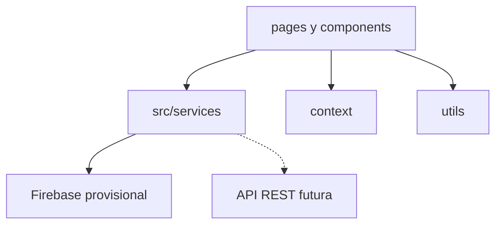

# Referencia de componentes

Catálogo de páginas y componentes de la aplicación. Indica qué hace cada uno, quién puede usarlo, qué servicios consume y qué contextos globales utiliza.

Para el flujo de negocio, ver [GUIA-FUNCIONAL.md](GUIA-FUNCIONAL.md). Para integración con backend, ver [INTEGRACION-BACKEND.md](INTEGRACION-BACKEND.md).

---

## Arquitectura general

Los componentes de interfaz **no acceden a Firebase directamente**. Toda lectura y escritura de datos pasa por `src/services/`.

---

## Contextos globales

| Contexto | Hook | Qué proporciona |
|----------|------|-----------------|
| `Auth.jsx` | `useAuth()` | `usuario`, `autenticado`, `esAdmin`, `puedeEscribir`, `listo`, `iniciarSesion`, `cerrarSesion` |
| `Retroalimentacion.jsx` | `useRetroalimentacion()` | Función para mostrar mensajes toast de éxito, error o información |
| `Confirmar.jsx` | `useConfirmar()` | Función para mostrar diálogos de confirmación antes de acciones destructivas |

---

## Componentes globales (`src/components/`)

| Componente | Archivo | Qué hace | Acceso | Servicios | Contextos |
|------------|---------|----------|--------|-----------|-----------|
| **Layout** | `Layout.jsx` | Shell de la app: cabecera, navegación, menú de usuario, contenido principal y pie de página | Autenticado | Ninguno | `useAuth` |
| **RequireAuth** | `RequireAuth.jsx` | Protege rutas: redirige a login si no hay sesión; redirige a inicio si se requiere admin y el usuario es miembro | — | Ninguno | `useAuth` |
| **Iconos** | `Iconos.jsx` | Biblioteca de iconos SVG reutilizables (logo, editar, eliminar, usuario, etc.) | — | Ninguno | Ninguno |

---

## Login (`src/pages/Login/`)

| Componente | Archivo | Qué hace | Acceso | Servicios | Contextos |
|------------|---------|----------|--------|-----------|-----------|
| **Login** | `Login.jsx` | Formulario de inicio de sesión con usuario y contraseña. Muestra credenciales de prueba. Redirige si ya hay sesión activa | Público | `authService` (vía `iniciarSesion`) | `useAuth` |

---

## Obras (`src/pages/Obras/`)

| Componente | Archivo | Qué hace | Acceso | Servicios | Contextos |
|------------|---------|----------|--------|-----------|-----------|
| **Obras** | `Obras.jsx` | Página principal: listado de obras con alta, edición y eliminación | Admin: escritura. Miembro: lectura | `obrasService` | `useAuth`, `useRetroalimentacion`, `useConfirmar` |
| **FormularioObra** | `components/FormularioObra.jsx` | Modal para crear o editar obra: título, clasificación y selección de autores | Admin | `autoresService` (cargar autores) | `useRetroalimentacion` |
| **TablaObras** | `components/TablaObras.jsx` | Contenedor de la tabla de obras | Ambos | Ninguno | Ninguno |
| **FilaObra** | `components/FilaObra.jsx` | Fila con datos de la obra, barra de avance y botones de acción | Admin: editar/eliminar/enlace detalle. Miembro: solo datos | Ninguno (usa `obraUtils` para porcentaje) | Ninguno |

---

## Autores (`src/pages/Autores/`)

| Componente | Archivo | Qué hace | Acceso | Servicios | Contextos |
|------------|---------|----------|--------|-----------|-----------|
| **Autores** | `Autores.jsx` | CRUD de autores (nombre, apellidos, correo) | Admin: escritura. Miembro: lectura | `autoresService` | `useAuth`, `useRetroalimentacion`, `useConfirmar` |
| **FormularioAutor** | `components/FormularioAutor.jsx` | Modal de alta/edición de autor | Admin | Ninguno (datos vía props) | Ninguno |
| **ListaAutores** | `components/ListaAutores.jsx` | Grid de tarjetas de autores con botones configurables | Ambos | Ninguno | Ninguno |
| **TarjetaAutor** | `components/TarjetaAutor.jsx` | Presentación de un autor (nombre, correo) | Ambos | Ninguno | Ninguno |

---

## Revisores (`src/pages/Revisores/`)

| Componente | Archivo | Qué hace | Acceso | Servicios | Contextos |
|------------|---------|----------|--------|-----------|-----------|
| **Revisores** | `Revisores.jsx` | CRUD de revisores (misma estructura que autores) | Admin: escritura. Miembro: lectura | `revisoresService` | `useAuth`, `useRetroalimentacion`, `useConfirmar` |
| **FormularioRevisor** | `components/FormularioRevisor.jsx` | Modal de alta/edición de revisor | Admin | Ninguno (datos vía props) | Ninguno |
| **ListaRevisores** | `components/ListaRevisores.jsx` | Grid de tarjetas de revisores (reutilizado en DetallesObra) | Ambos | Ninguno | Ninguno |
| **TarjetaRevisor** | `components/TarjetaRevisor.jsx` | Presentación de un revisor | Ambos | Ninguno | Ninguno |

---

## Miembros CE (`src/pages/MiembrosCE/`)

| Componente | Archivo | Qué hace | Acceso | Servicios | Contextos |
|------------|---------|----------|--------|-----------|-----------|
| **MiembrosCE** | `MiembrosCE.jsx` | CRUD de miembros del Consejo Editorial | Solo admin (ruta protegida) | `miembrosCEService` | `useRetroalimentacion`, `useConfirmar` |
| **FormularioMiembroCE** | `components/FormularioMiembroCE.jsx` | Modal de alta/edición de miembro | Admin | Ninguno (datos vía props) | Ninguno |
| **ListaMiembrosCE** | `components/ListaMiembrosCE.jsx` | Grid de tarjetas de miembros | Admin | Ninguno | Ninguno |
| **TarjetaMiembroCE** | `components/TarjetaMiembroCE.jsx` | Presentación de un miembro del CE | Admin | Ninguno | Ninguno |

---

## Detalle de obra (`src/pages/DetallesObra/`)

| Componente | Archivo | Qué hace | Acceso | Servicios | Contextos |
|------------|---------|----------|--------|-----------|-----------|
| **DetallesObra** | `DetallesObra.jsx` | Orquesta el flujo editorial: carga la obra, muestra tarjeta resumen y las 6 etapas secuenciales | Solo admin | `obrasService` | `useAuth`, `useRetroalimentacion` |
| **TarjetaObra** | `components/TarjetaObra.jsx` | Resumen: título, clasificación, autores, estado y gráfica de avance | Admin | `autoresService` (resolver autores por ID) | Ninguno |
| **GraficaDona** | `components/GraficaDona.jsx` | Gráfica circular de porcentaje de avance | — | Ninguno | Ninguno |
| **Temporizador** | `components/Temporizador.jsx` | Cuenta regresiva hasta la fecha límite; indica «Tiempo vencido» si ya pasó | — | Ninguno | Ninguno |

### Etapas del flujo editorial

| # | Etapa | Componente | Archivo | Qué hace | Servicios | Contextos |
|---|-------|------------|---------|----------|-----------|-----------|
| 1 | Verificación de la clasificación | **VerificacionObra** | `components/VerificacionObra.jsx` | Pregunta si la clasificación es apta (Sí/No) | `obrasService` | `useRetroalimentacion` |
| 2 | Establecer revisores y plazos | **RevisoresPlazos** | `components/RevisoresPlazos.jsx` | Define revisores mínimos y fecha límite de asignación | `obrasService` | `useRetroalimentacion` |
| 3 | Asignación de revisores | **AsignarRevisores** | `components/AsignarRevisores.jsx` | Añade/quita revisores, muestra progreso y temporizador | `obrasService`, `revisoresService` | `useRetroalimentacion`, `useConfirmar` |
| 4 | Establecer revisiones y plazos | **RevisionesPlazos** | `components/RevisionesPlazos.jsx` | Define revisiones mínimas y fecha límite de revisiones | `obrasService` | `useRetroalimentacion` |
| 5 | Revisión en proceso | **Revision** | `components/Revision.jsx` | Marca revisiones completadas/pendientes por revisor | `obrasService`, `revisoresService` | `useRetroalimentacion`, `useConfirmar` |
| 6 | Toma de decisión final | **DecisionFinal** | `components/DecisionFinal.jsx` | Registra decisión: Aprobar, Rechazar o Solicitar modificaciones | `obrasService` | `useRetroalimentacion` |

> **Nota:** `DetallesObra` reutiliza `FormularioObra` (de Obras) para editar los datos generales de la obra desde el detalle.

---

## Utilidades (`src/utils/`)

| Archivo | Qué hace | Usado por |
|---------|----------|-----------|
| `obraUtils.js` | Etapas completadas, cascada al desmarcar, efectos de cambio de clasificación, porcentaje de avance | DetallesObra, Obras, FilaObra, etapas |
| `validaciones.js` | Validación de formato de correo electrónico | Autores, Revisores, MiembrosCE |
| `fechas.js` | Conversión de fecha de formulario a timestamp (fin de día, UTC-6) | RevisoresPlazos, RevisionesPlazos |

---

## Documentación relacionada

- [README.md](../README.md) — Instalación y configuración.
- [GUIA-FUNCIONAL.md](GUIA-FUNCIONAL.md) — Flujo de uso y roles.
- [INTEGRACION-BACKEND.md](INTEGRACION-BACKEND.md) — Contratos de datos y migración a API REST.
